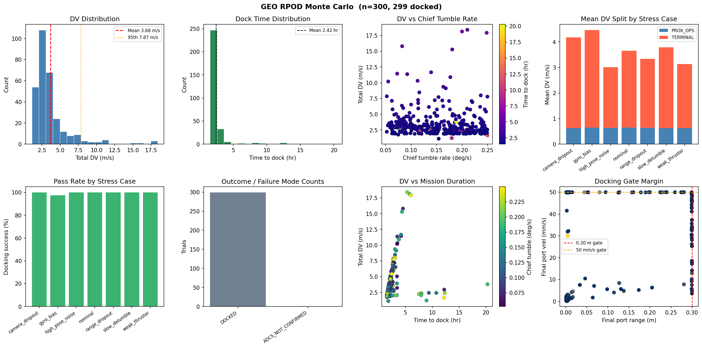
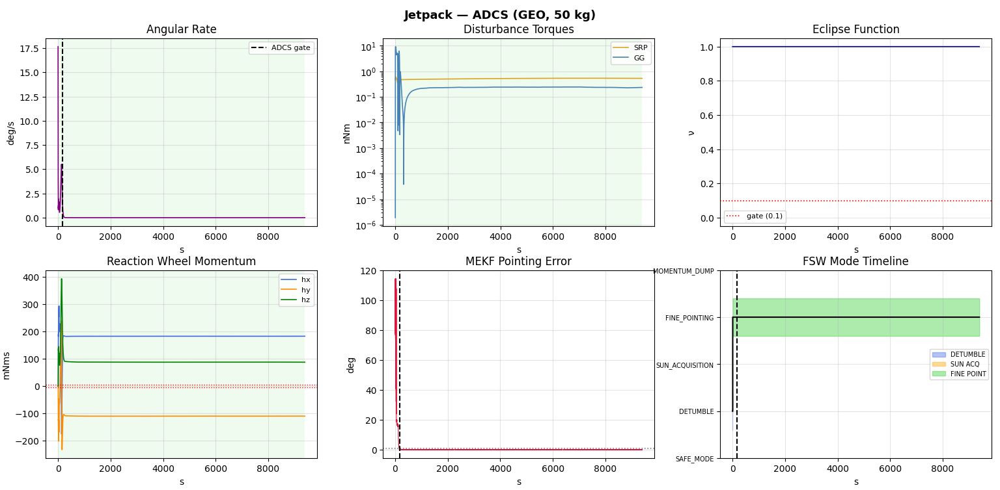
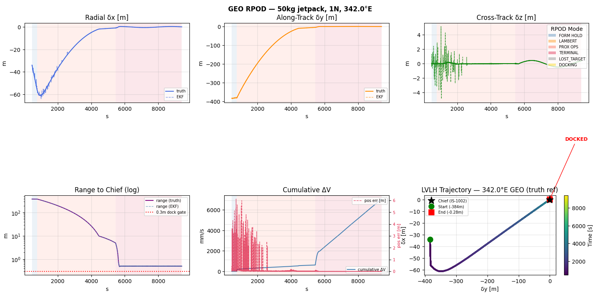

# GEO RPOD Flight Simulation

High-fidelity Python simulation for GEO rendezvous, proximity operations, and docking (RPOD) of a 50 kg deputy spacecraft approaching a tumbling GEO chief.

The model is an end-to-end GNC reference environment: GEO relative dynamics, environmental disturbances, sensors, attitude estimation, relative navigation, ADCS, Lambert transfer, terminal docking-port targeting, lost-target handling, and Monte Carlo robustness analysis.

This repository is the Python reference model. The embedded C flight-software/SIL implementation lives in the companion `Satellite_GNC` repository.

> Status: research/prototype GNC simulation. This is not flight-certified software.

## Latest Monte Carlo Result

Latest run: `300` trials, `8` workers

Result: `299 / 300` docked, `99.7%` docking success

Failure outcome:

- `ADCS_NOT_CONFIRMED`: `1`

Stress-case pass rate:

| Stress case | Docked | Trials | Pass rate |
|---|---:|---:|---:|
| Nominal | 165 | 165 | 100.0% |
| Camera dropout | 20 | 20 | 100.0% |
| Gyro bias | 37 | 38 | 97.4% |
| High pose noise | 20 | 20 | 100.0% |
| Range dropout | 24 | 24 | 100.0% |
| Slow detumble | 10 | 10 | 100.0% |
| Weak thruster | 23 | 23 | 100.0% |

Performance summary:

| Metric | Mean | Std | 5th % | Median | 95th % |
|---|---:|---:|---:|---:|---:|
| Total delta-V (m/s) | 3.683 | 2.518 | 1.933 | 2.977 | 7.868 |
| PROX_OPS delta-V (m/s) | 0.641 | 0.057 | 0.610 | 0.632 | 0.678 |
| TERMINAL delta-V (m/s) | 3.043 | 2.520 | 1.291 | 2.334 | 7.254 |
| Time to dock (hr) | 2.418 | 1.855 | 1.563 | 1.936 | 4.368 |
| Chief tumble (deg/s) | 0.152 | 0.058 | 0.067 | 0.151 | 0.242 |
| Final port range (m) | 0.065 | 0.111 | 0.002 | 0.004 | 0.300 |
| Final port relative speed (m/s) | 0.021 | 0.022 | 0.001 | 0.003 | 0.050 |

Propellant estimate at `Isp = 220 s` hydrazine:

| Metric | Propellant |
|---|---:|
| Mean | 85.2 g |
| 95th percentile | 182.0 g |
| Worst case | 424.7 g |

Correlation checks:

- Total delta-V vs chief tumble rate: `-0.034`
- Total delta-V vs time-to-dock: `+0.220`

Latest generated artifacts:

```text
monte_carlo_results.npz
monte_carlo_summary.txt
monte_carlo_plots.png
```

## Key Figures

### Monte Carlo Performance



The Monte Carlo plot summarizes delta-V distribution, docking time distribution, stress-case pass rates, outcome counts, mission-duration sensitivity, and final docking-gate margins.

### ADCS / Mode Timeline



The ADCS plot shows angular-rate convergence, disturbance torques, eclipse function, reaction-wheel momentum, MEKF pointing error, and FSW mode progression.

### RPOD Trajectory



The RPOD plot shows LVLH relative motion, truth-vs-EKF position channels, log-range closure, cumulative delta-V, and the final close-approach trajectory into the docking port.

## Mission Scenario

| Item | Value |
|---|---:|
| Chief orbit | GEO, `a = 42164 km`, `e = 0.0003`, `i = 0.8 deg` |
| Chief longitude | `342.0 deg E` |
| Deputy mass | `50 kg` |
| Deputy thrust | `1 N` |
| Deputy max acceleration | `20 mm/s^2` |
| Initial standoff | `1000 m` trailing |
| Inner ADCS step | `0.01 s` |
| RPOD outer-loop step | `0.1 s` |
| Terminal handoff | `5 m` |
| Docking capture radius | `0.30 m` |
| Docking relative-speed gate | `0.05 m/s` |
| Formation-hold EKF settle | `300 s` |

## Architecture

```text
main.py
  |
  +-- environment/
  |     GEO orbit, CW dynamics, SRP, drag, magnetic field,
  |     gravity gradient, sun model, chief tumble
  |
  +-- plant/
  |     deputy spacecraft rigid-body attitude dynamics
  |
  +-- sensors/
  |     gyro, magnetometer, sun sensor, star tracker,
  |     ranging/bearing sensor, camera/PnP-style port sensor
  |
  +-- estimation/
  |     QUEST, MEKF, TH-EKF, chief pose / port tracking
  |
  +-- control/
  |     Lambert transfer, RPOD phase controller, ADCS controller
  |
  +-- fsw/
        high-level mode manager and mission phase logic
```

## Flight Sequence

```text
DETUMBLE
  -> SUN_ACQUISITION
  -> FINE_POINTING
  -> FORMATION_HOLD
  -> LAMBERT
  -> PROX_OPS
  -> TERMINAL
  -> DOCKING
```

Major behaviors:

- B-dot detumbling reduces initial body rates.
- QUEST seeds the attitude estimate.
- MEKF maintains fine pointing using gyro/vector measurements.
- TH-EKF estimates relative position and velocity.
- Lambert guidance moves from standoff toward close approach.
- PROX_OPS uses continuous square-root-law closure.
- TERMINAL targets the docking port, not just the chief center of mass.
- Docking is confirmed using port range and relative velocity.

## Main Components

### Attitude Dynamics And ADCS

The deputy attitude model includes rigid-body rotational dynamics, reaction wheels, magnetorquers, environmental disturbances, and closed-loop pointing control.

Tracked ADCS outputs include:

- angular rate
- wheel momentum
- disturbance torques
- MEKF pointing error
- FSW mode history

### Relative Dynamics

Relative motion is propagated in LVLH around a GEO chief. The simulation includes mission-relevant GEO perturbation terms such as differential solar radiation pressure and disturbance torques.

### Navigation

Navigation is split into:

- MEKF for attitude and gyro-bias estimation
- TH-EKF for relative orbit estimation
- chief pose estimation for docking-port geometry
- terminal close-range port measurement filtering

Terminal logic uses close-range port measurements when available to reduce late-stage estimator lag and to track the rotating chief docking interface.

### RPOD Guidance

The RPOD controller includes:

- formation hold
- Lambert transfer
- PROX_OPS approach
- TERMINAL docking-port closure
- lost-target hold/recovery
- docking detection

The terminal controller uses a speed-limited range law and a docking-port target derived from chief pose. The current tuning reduces terminal hover waste while keeping final relative speed inside the docking gate.

### Chief Attitude And Docking Port

The chief is modeled as a tumbling target with a body-fixed docking port:

```text
DOCK_PORT_BODY = [0, 0, 0.5] m
DOCK_AXIS_BODY = [0, 0, 1]
```

The simulation estimates and tracks the port in LVLH during terminal approach. This is one of the key differences between a simple translational rendezvous model and a servicing-relevant 6-DOF RPOD model.

## Monte Carlo

Run the Monte Carlo campaign:

```bat
python monte_carlo.py --trials 300 --workers 8
```

Outputs:

```text
monte_carlo_results.npz
monte_carlo_summary.txt
monte_carlo_plots.png
```

The current Monte Carlo includes nominal and stressed runs:

- camera dropout
- gyro bias
- high pose noise
- range dropout
- slow detumble
- weak thruster

The current 300-run result reached `99.7%` docking success. The single miss was an ADCS acquisition/confirmation failure, not a terminal RPOD miss.

## Single-Run Simulation

Run the nominal mission:

```bat
python main.py
```

Expected outputs:

- console mission timeline
- docking confirmation if successful
- ADCS summary figure
- RPOD trajectory figure

## Requirements

Install Python dependencies:

```bat
pip install -r Requirements.txt
```

Core dependencies include:

- `numpy`
- `scipy`
- `matplotlib`

The model is developed and exercised on Windows. The Python code is otherwise standard scientific Python.

## Validation Philosophy

This repository is the algorithmic reference for:

- mission feasibility
- guidance-law tuning
- estimator behavior
- docking-port terminal approach
- Monte Carlo performance
- embedded C parity and SIL comparison

The companion C implementation should be treated as the embedded flight-software candidate. This Python repository remains the higher-fidelity simulation and analysis environment.

## Current Limitations

This is an engineering simulation, not a certified flight dynamics tool.

Known limitations:

- Contact dynamics are simplified; docking confirmation stops the run rather than simulating hard/soft capture mechanics.
- Docking-port pose is modeled through simulated chief attitude and pose estimation, not a full optical image-processing stack.
- GEO environmental models are suitable for GNC trade studies, not final mission operations.
- Thermal, power, communications, plume impingement, and flexible-body dynamics are out of scope.
- The Monte Carlo campaign covers important stress cases but is not yet a full mission assurance campaign.
- FDIR is represented at the mode/guidance level; formal fault trees, FMECA tables, and abort/retreat logic are future work.

## Next Engineering Steps

Before presenting this as flight-ready GNC software, the next review items are:

1. Add a formal FDIR/FMECA table with hazard severity, detection logic, response, and verification test for each fault.
2. Add explicit abort/retreat behavior after prolonged terminal target loss or failed docking-gate convergence.
3. Add multi-sample docking confirmation and explicit post-contact state handling.
4. Add approach-axis and attitude-alignment gates for final docking.
5. Version the Monte Carlo configuration with each results file.
6. Cross-check Python results against the C SIL after every major guidance or estimator change.

## Relationship To Embedded C Repo

The Python simulation is the reference model. The C flight-software repository implements the embedded/SIL side:

```text
Satellite_GNC/
  src_c/
  sim_python/
  tests/
```

The C repo mirrors the key RPOD, TH-EKF, MEKF, ADCS, terminal filtering, port tracking, and mode-manager logic and is verified through C unit tests plus Python closed-loop SIL.

## Version Control Notes

Recommended to commit:

- source code
- requirements
- README
- `monte_carlo_summary.txt`
- selected review figures such as `monte_carlo_plots.png`, `Figure_1.png`, and `Figure_2.png`

Recommended to avoid committing by default:

- large telemetry CSVs
- `__pycache__/`
- temporary plots
- large raw Monte Carlo archives unless they are part of a tagged result release

## Author

Venkat Sainath

MSc Space Engineering
